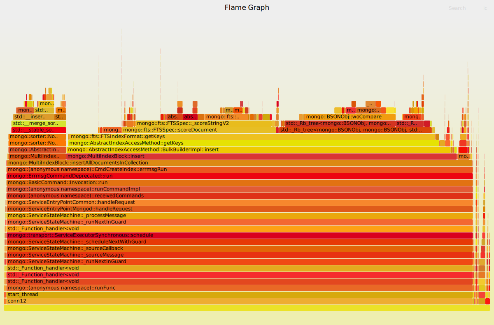
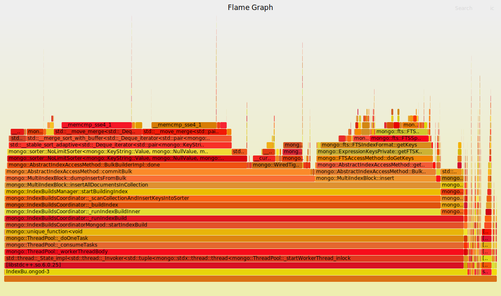

# createIndex Performance

MongoDB has built-in [full-text indexing](https://docs.mongodb.com/manual/core/index-text/). It is a conventional [inverted index](https://en.wikipedia.org/wiki/Inverted_index) and supports bulk building on an existing collection. For large collections, index building speed can be an important factor.

**tl;dr MongoDB at HEAD (4.5.0-1037-gbe29fb1023) `createIndex` is ~30% faster than 4.2.6.**

Table of Contents
=================

  * [Test Data](#test-data)
  * [MongoDB Version](#mongodb-version)
  * [maxIndexBuildMemoryUsageMegabytes](#maxindexbuildmemoryusagemegabytes)
  * [Collection Scan vs Inserting](#collection-scan-vs-inserting)
  * [GNU sort (8.30)](#gnu-sort-830)
  * [std::stable_sort](#stdstable_sort)
  * [Stemming](#stemming)
  * [Tokenizer](#tokenizer)
  * [Profiling](#profiling)
  * [MongoDB at HEAD (r4.5.0-1037-gbe29fb1023)](#mongodb-at-head-r450-1037-gbe29fb1023)
  * [TermFrequencyMap / absl::flat_hash_map](#termfrequencymap--abslflat_hash_map)

Created by [gh-md-toc](https://github.com/ekalinin/github-markdown-toc)

## Test Data

The data is designed to approximate English text. It is generated using this Python script: [fill.py](fill.py). The collection has 600 K documents (165 MiB) looks like this:

```
> db.words.find()
{ "_id" : ObjectId("5eaa56f780f0ab1e6f96738c"), "body" : "idpyo umzgdpamnty woix sdkaaau amvgnxaqhyop hlhvhyojanru fuxjd xwqnqvgjj qmsbphxzmnv lrwyvx covqdyfqm pxapbjwts uffqhaygrr mqlsloi" }
{ "_id" : ObjectId("5eaa56f780f0ab1e6f96738d"), "body" : "txamzxqzeqyr nbplsrg nplnlarrtztk tazhufrsfcz zibvccaoayyi idztflj ffiqf uwjowkpp ajmkn idixqgt ahamebxfow vnrhuzwqohqu mvsz vunbxjegb ccjjxfns earbsgso ywtqbm ldgsvns pdvmjqp ktmj fgkz kngivd rlvrpyrhcx ceff giyktqilkkdj tywpesr kbncm ekdtsz csrhsciljs doidzbjatvac dzbghzsnfd" }
{ "_id" : ObjectId("5eaa56f780f0ab1e6f96738e"), "body" : "vhfxdn zrjriwpkdg baazjxtko kmccktodig wpvlifrgjghl icyoc hmjbkfkzs hkdrtszt hhazh circxcauaj ppedqyzkc vffyeekjdwqt egerxbyk xwgfjnrfbwvh ycvoznri oroamkfipazu sabwlsesee imsmftch afqkquovuxh kpvphwn rtxuiuhbc ulfqyzgjjwjr fwwxotcdt smfeingsxyzb" }
{ "_id" : ObjectId("5eaa56f780f0ab1e6f96738f"), "body" : "wulmqfrxbq ziudi eytvv ohmzn fkoetpgdnt ndvjihmxragq saauthigfje gijsyivozzfr pndygsmgj zadsx rjvy cqlszj qvlyqkadow ljrmkzxvspd mgraiutxxx gotqnxwjwfot glqavmsnmkts pxhuu uanxueuy zifycytali vrjeoipfoq iqdx clcvoafqwf muwit gqghkicc" }
...
```

and stats:

```
> db.stats()
{
	"db" : "wordsdb",
	"collections" : 1,
	"views" : 0,
	"objects" : 600000,
	"avgObjSize" : 289.1219566666667,
	"dataSize" : 173473174,
	"storageSize" : 320131072,
	"numExtents" : 0,
	"indexes" : 2,
	"indexSize" : 372158464,
	"scaleFactor" : 1,
	"fsUsedSize" : 17451036672,
	"fsTotalSize" : 18882445312,
	"ok" : 1
}
```

## MongoDB Version

Initially, tests are done using MongoDB 4.2.6 (default version for Debian buster as of May 2020). As we will see later, MongoDB has significantly improved indexing performance in newer versions.

## maxIndexBuildMemoryUsageMegabytes

`maxIndexBuildMemoryUsageMegabytes` is a [documented](https://docs.mongodb.com/manual/reference/parameters/#param.maxIndexBuildMemoryUsageMegabytes) parameter for index building. It **did not have a significant effect** on speed:

```
-- Sat May  2 20:20:08 EDT 2020
+ sudo sed -i 's/\(maxIndexBuildMemoryUsageMegabytes:\) .*/\1 50/' /etc/mongod.conf
real  1m9.604s
+ sudo sed -i 's/\(maxIndexBuildMemoryUsageMegabytes:\) .*/\1 64/' /etc/mongod.conf
real  1m6.418s
+ sudo sed -i 's/\(maxIndexBuildMemoryUsageMegabytes:\) .*/\1 128/' /etc/mongod.conf
real  1m5.638s
+ sudo sed -i 's/\(maxIndexBuildMemoryUsageMegabytes:\) .*/\1 256/' /etc/mongod.conf
real  1m6.865s
+ sudo sed -i 's/\(maxIndexBuildMemoryUsageMegabytes:\) .*/\1 512/' /etc/mongod.conf
real  1m10.501s
+ sudo sed -i 's/\(maxIndexBuildMemoryUsageMegabytes:\) .*/\1 1024/' /etc/mongod.conf
real  1m10.880s
```

## Collection Scan vs Inserting

Indexing is performed in two stages:

1. *Collection scan*: read all documents and tokenize (+ locale-specific processing like stemming, stopwords); periodically, in-memory **sort** the tokens. (If necessary to control memory usage, flush batches to disk.)
2. *Insert into index*: insert sorted tokens into the index table. This is much faster than inserting keys in random order.

With default `maxIndexBuildMemoryUsageMegabytes`, *collection scan* takes about 75% of the total build time. While changing `maxIndexBuildMemoryUsageMegabytes`, the relative time between phases changes but **total build time does not change significantly**:

```
sudo cat /var/log/mongodb/mongod.log | \
  grep '^2020-05-02' |
  egrep '(index build: collection scan done|index build: inserted .* from external)'
2020-05-02T20:20:58.923-0400 I  INDEX    [conn2] index build: collection scan done. scanned 600000 total records in 48 seconds
2020-05-02T20:21:16.223-0400 I  INDEX    [conn2] index build: inserted 15009042 keys from external sorter into index in 17 seconds
2020-05-02T20:22:10.886-0400 I  INDEX    [conn2] index build: collection scan done. scanned 600000 total records in 48 seconds
2020-05-02T20:22:26.916-0400 I  INDEX    [conn2] index build: inserted 15009042 keys from external sorter into index in 16 seconds
2020-05-02T20:23:21.434-0400 I  INDEX    [conn2] index build: collection scan done. scanned 600000 total records in 50 seconds
2020-05-02T20:23:35.782-0400 I  INDEX    [conn2] index build: inserted 15009042 keys from external sorter into index in 14 seconds
2020-05-02T20:24:31.985-0400 I  INDEX    [conn2] index build: collection scan done. scanned 600000 total records in 53 seconds
2020-05-02T20:24:44.750-0400 I  INDEX    [conn2] index build: inserted 15009042 keys from external sorter into index in 12 seconds
2020-05-02T20:25:32.691-0400 I  INDEX    [conn2] index build: collection scan done. scanned 600000 total records in 45 seconds
2020-05-02T20:25:55.740-0400 I  INDEX    [conn2] index build: inserted 15009042 keys from external sorter into index in 23 seconds
2020-05-02T20:26:21.226-0400 I  INDEX    [conn2] index build: collection scan done. scanned 600000 total records in 20 seconds
2020-05-02T20:27:08.212-0400 I  INDEX    [conn2] index build: inserted 15009042 keys from external sorter into index in 46 seconds
```

## GNU sort (8.30)

As a baseline, here are timings for `sort` command. Note `--parallel=1` for a fair comparison with MongoDB's single-threaded sorting.

```
mongoexport -d wordsdb -c words | awk '{ match($0, /"body":"(.*)"/, fs); print fs[1] }' | sed 's/ /\n/g' > words.txt

$ time sort --parallel=1 words.txt >/dev/null

real  0m43.088s
user  0m42.622s
sys 0m0.393s

$ time LC_ALL=C sort --parallel=1 words.txt >/dev/null

real  0m13.296s
user  0m12.828s
sys 0m0.460s
```

Note the **locale** has a significant impact on performance, and this has been previously documented:
*   [How to sort big files?](https://unix.stackexchange.com/a/120108/369156)
*   [sort is very slow for big files](https://askubuntu.com/a/1169049)

Note `LC_ALL=C` will sort non-ASCII characters incorrectly.

## std::stable_sort

Internally, MongoDB uses [std::stable_sort](https://en.cppreference.com/w/cpp/algorithm/stable_sort). What is the ideal case, for sorting alone, words contiguous in memory? See [stable_sort.cc](stable_sort.cc):

```
$ time ./stable_sort
reading...
tokenizing...
got 15009167 words
sorting...
sorted:  aaaa aaaabjdnyz aaaabxchjom aaaac aaaacyuywpe aaaafx aaaagddllqk aaaagyjanjv aaaahjjw

real  0m7.780s
user  0m7.613s
sys 0m0.160s
```

## Stemming

Setting `default_language: none` disables stemming, but this does not seem to have a significant effect:

```
$ time mongo wordsdb --quiet --eval 'db.words.createIndex({"body":"text"},{"default_language":"none"})'
{
  "createdCollectionAutomatically" : false,
  "numIndexesBefore" : 1,
  "numIndexesAfter" : 2,
  "ok" : 1
}

real  1m3.394s
user  0m0.059s
sys 0m0.030s
```

Though note the experiment is slightly inconclusive because the test words are not actual English words, so they would not trigger the stemming logic in the same way.

## Tokenizer

The default full-text index is version 3; the older [version 2](https://docs.mongodb.com/manual/core/index-text/#versions) uses a simpler tokenizer (BasicFTSTokenizer), but this also does not have much of an effect:

```
$ time mongo wordsdb --quiet --eval 'db.words.createIndex({"body":"text"},{"textIndexVersion":2,"default_language":"none"})'
{
  "createdCollectionAutomatically" : false,
  "numIndexesBefore" : 1,
  "numIndexesAfter" : 2,
  "ok" : 1
}

real  1m2.937s
user  0m0.074s
sys 0m0.027s
```

## Profiling

Linux [`perf record`](https://perf.wiki.kernel.org/index.php/Tutorial#Sampling_with_perf_record) allows collecting very rich CPU profiles:

```
Samples: 41K of event 'cycles', Event count (approx.): 33730232557
  Children      Self  Command          Shared Object            Symbol
+   97.76%     0.06%  conn10           mongod                   [.] mongo::MultiIndexBlock::insertAllDocumentsInCollection   ◆
+   88.23%     0.03%  conn10           mongod                   [.] mongo::MultiIndexBlock::insert                           ▒
+   87.12%     0.29%  conn10           mongod                   [.] mongo::AbstractIndexAccessMethod::BulkBuilderImpl::insert▒
+   84.25%     0.06%  conn10           mongod                   [.] mongo::AbstractIndexAccessMethod::getKeys                ▒
+   83.07%     6.55%  conn10           mongod                   [.] mongo::fts::FTSIndexFormat::getKeys                      ▒
+   35.43%     0.49%  conn10           mongod                   [.] std::_Rb_tree<mongo::BSONObj, mongo::BSONObj, std::_Ident▒
+   34.03%     0.16%  conn10           mongod                   [.] mongo::fts::FTSSpec::scoreDocument                       ▒
+   29.93%     5.48%  conn10           mongod                   [.] mongo::fts::FTSSpec::_scoreStringV2                      ▒
+   25.82%     3.32%  conn10           mongod                   [.] std::_Rb_tree<mongo::BSONObj, mongo::BSONObj, std::_Ident▒
+   25.82%     8.85%  conn10           mongod                   [.] mongo::BSONObj::woCompare                                ▒
+   10.42%     4.66%  conn10           mongod                   [.] mongo::fts::UnicodeFTSTokenizer::moveNext                ▒
+    8.21%     3.24%  conn10           mongod                   [.] mongo::BSONElement::compareElements                      ▒
+    6.56%     1.52%  conn10           mongod                   [.] std::_Rb_tree<mongo::BSONObj, mongo::BSONObj, std::_Ident▒
+    5.54%     0.59%  conn10           mongod                   [.] mongo::sorter::NoLimitSorter<mongo::BSONObj, mongo::Recor▒
+    5.54%     0.00%  conn10           mongod                   [.] mongo::MultiIndexBlock::dumpInsertsFromBulk              ▒
+    5.54%     0.00%  conn10           mongod                   [.] mongo::AbstractIndexAccessMethod::commitBulk             ▒
+    5.54%     0.00%  conn10           mongod                   [.] mongo::sorter::NoLimitSorter<mongo::BSONObj, mongo::Recor▒
```

And [Brendan Gregg's Flame Graphs](http://www.brendangregg.com/FlameGraphs/cpuflamegraphs.html) allow visualizing the profile very nicely:



## MongoDB at HEAD (r4.5.0-1037-gbe29fb1023)

There have been many improvements to indexing performance since 4.2 (first release 4.2.1 in October 2019), in git HEAD (May 2020) it is **~30% faster**:

```
$ time mongo wordsdb --quiet --eval 'db.words.createIndex({"body":"text"},{"textIndexVersion":2,"default_language":"none"})'
{
  "createdCollectionAutomatically" : false,
  "numIndexesBefore" : 1,
  "numIndexesAfter" : 2,
  "ok" : 1
}

real  0m44.454s
user  0m0.076s
sys 0m0.017s
```

and the profile reflects optimizations in **collection scan** phase and relatively more time spent in sorting. Also index keys have been refactored from `BSONObj` (which spent a lot of time in `woCompare`), to strings (note prominence of `memcmp`):



## TermFrequencyMap / absl::flat_hash_map

`TermFrequencyMap` is used as temporary storage of terms for a single document, then, discarded. It is a `stdx::unordered_map<std::string, double>` which is defined as a [`absl::node_hash_map`](https://abseil.io/docs/cpp/guides/container#abslnode_hash_map-and-abslnode_hash_set). Such small and short-lived maps can sometimes benefit from `absl::flat_hash_map`, which is the [recommended default](https://abseil.io/docs/cpp/guides/container#abslflat_hash_map-and-abslflat_hash_set). Unfortunately, this does not help performance much:

```
$ time mongo wordsdb --quiet --eval 'db.words.createIndex({"body":"text"},{"textIndexVersion":2,"default_language":"none"})'
{
  "createdCollectionAutomatically" : false,
  "numIndexesBefore" : 1,
  "numIndexesAfter" : 2,
  "ok" : 1
}

real  0m47.421s
user  0m0.076s
sys 0m0.016s
```
