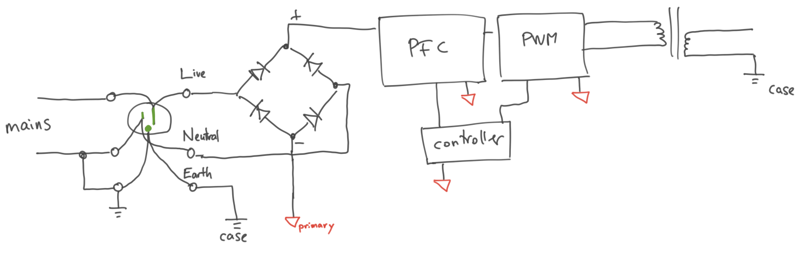
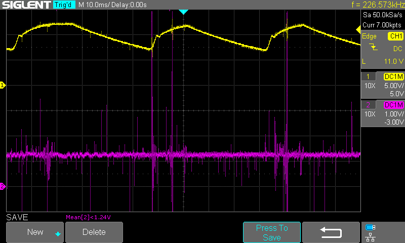

# Enermax Tomahawk ETK450AWT PSU Repair

* [Introduction](#introduction)
* [PWR_OK](#pwr_ok)
* [Primary](#primary)
    * [Isolation transformer](#isolation-transformer)
* [Primary (continued)](#primary-continued)
* [Auxiliary supply](#auxiliary-supply)
* [Equivalent series resistance](#equivalent-series-resistance)
* [Thanks](#thanks)

Created by [gh-md-toc](https://github.com/ekalinin/github-markdown-toc)

## Introduction

I've had an Enermax Tomahawk ETK450AWT 450 W power supply for 10 years, never had a problem, until a few weeks ago. The symptoms were strange - the machine would start booting, then at a particular point during the boot process, it would spontaneously reboot. Sometimes it would finish booting, then during routine use, randomly reboot. I checked `/var/log/syslog`, nothing interesting.

At one point, when turning on the power, the power supply would come on (fans spin, lights on), for around ~3 seconds, then power off. Huh! That's before the OS runs, even before the BIOS runs. Must be a hardware problem.

ATX power supplies provide a "power OK" signal to the motherboard ([ATX power supply pinout](https://www.smpspowersupply.com/connectors-pinouts.html)). Maybe the motherboard detects some problem with the supply? Let's check the voltages and "power OK".

Ripple (± y.yyy) was measured using a _voltmeter on AC setting_, due to convenience - this is **not** a correct measurement of ripple, just gives a general idea. "HP" column is from a known good, HP brand power supply.

| Rail   | Off  | On (PSU_ON# to ground), no load | On, load (light bulb, on each rail at a time) | HP On, no load |
|--------|------|---------------------------------|-----------------------------------------------|----------------|
| +3.3V  |      | 3.24 ± 0.038                    | 2.85 ± 0.350 (load 0.15 A)                    | 3.38           |
| +5V    |      | 5.13 ± 0.025                    | 4.62 ± 0.370 (load 0.18 A)                    | 5.10           |
| +12V1  |      | 11.83 ± 0.310                   | 10.7 ± 0.740 (load 0.25 A)                    | 12.13          |
| +12V2  |      | effectively tied to +12V1       |                                               |                |
| -12V   |      | -11.7 ± 0.240                   | no start                                      |                |
| +5Vsb  | 5.16 | 5.16 ± 0.003                    | 5.04 ± 0.00 (0.19 A)                          |                |
| PWR_OK |      | 0.05                            |                                               | 3.36           |
| PS_ON# | 4.94 |                                 |                                               |                |

Note the +12V DC value was ~10% below nominal. The +5V standby supply has very low ripple, much lower than the main rails (+3.3V, +5V, +12V), which suggests the standby supply may be working correctly. The +12V rail, when loaded, has significantly higher ripple.

Here is the +12V waveform - pretty bad:

The period of the signal is around 40 ms, which is quite long. For comparison, the typical switching frequency of a SMPS is around 100 kHz (10 µs period). That's what we would see if it was a problem with a bypass capacitor on the output.

On the other hand, switching supplies have features like slow start and protection logic, which does operate on the time scale of milliseconds, so the culprit is more likely something related to those.

## PWR_OK

Let's dive deeper into the `PWR_OK` signal. Where does this signal come from? Most PC power supplies since the 1990's have [similar designs](http://danyk.cz/s_atx_en.html), which gives some good tips on the general structure. Let's also open up our supply itself, to make sure the actual unit matches the tips from the web:

On the secondary side, there is a [SG5616 "supervisor IC"](https://www.mouser.com/datasheet/2/149/SG6516-1012077.pdf) which checks the output voltages, output currents and other indicators, and generates the `PWR_OK` signal. Let's check the voltages on this chip:

| | | | | | |  |
|--|--|--|--|--|--|--|
| 0.05 | 5.10 | 5.1 | 3.30   | 11.4  | 3.25 | 5.06  |
| PGO  | VDD  | VS5 | VS33   | VS12  | IS33 | IS5   |
|      |      |     | **SG6516** |       |      |       |
| PGI  | GND  | FPO | PSON   | IS12  | RI   | VS12B |
| 0.90 | 0    | 0.1 | 0.07   | 11.15 | 1.27 | 11.3  |

All look normal, except for one: `PGI` (Power Good Input). `CH1` is `+12V` output, while `CH2` is `PGI`:

`PGI` pin is documented as "For ATX SMPS, it detects AC line voltage through the main transformer" and nominal value is 1.25 V. But the datasheet "typical application" figure does not show the actual circuit between "main transformer" and `PGI` pin.

After some searching, we can find very similar "supervisor IC", also with a `PGI` pin, and a more insightful application diagram (page 8): [PS224 4-Channel Secondary Monitoring IC](http://silicon-touch.com/product/spec/Power/PS224.pdf#page=8). There are often families of similar chips (sometimes pin-compatible!), where one datasheet sheds more light on some similar other chip. The PS224 datasheet shows that `PGI` is typically derived by diode + resistor (or Zener) from the secondary, and indeed this is the case for our unit (D18, R44).

Note also that the voltage on the secondary winding of the main transformer corresponds well with the ripple on the +12V output rail:

It seems like for some time (~10 ms) the supply starts switching. The typical switching frequency is around 100 kHz which is why on this time scale (10 ms/div) it looks like very rapid bursts. During this time, the +12V output rail also increases as the output capacitor charges. But, shortly after that (~30 ms), the switching stops completely, and the output capacitor slowly discharges.

From now we will use +12V output as the "heartbeat" of the circuit and show other signals in time reference to the +12V output, where it seems the main supply is periodically starting and stopping.

It is a good time to review the principle of switching mode power supply (SMPS) and typical design: https://www.apogeeweb.net/article/55.html

## Primary

Why does the main transformer cycle on and off? It is difficult to even see the design of the primary side, as the physical space is very limited. There are no IC on the primary side of main board, but there is a 10-pin daughter card mounted vertically and it is very difficult to see the components on that card, but we do see an IC:

After a lot of squinting, we can see that the card has a [CM6800 PFC/PWM Controller Combo](https://www.alldatasheet.com/datasheet-pdf/pdf/85304/ETC/CM6800.html). Aside from that, there are a few resistors, diodes, SMD ceramic capacitors, and electrolytic capacitors. Ultimately, this card controls the entire primary side.

Note that the typical application diagram (page 15) is again very .. minimal (no component values). There is a similar chip [ML4800 Power Factor Correction and PWM Controller Combo](http://www.rom.by/files/ml4800-64984.pdf) with a much more generous application diagram (page 14).

We don't have direct access to probe the CM6800 pins, but the card doesn't have too many parts, and we can match card pins with IC pins by guessing from the voltage and connections to other components:

| RECT- | VDC+      | VDC- | RECT+   | FPO         | VFB  | PFC       | ILIMIT | GND  | PWM       |
|-------|-----------|------|---------|-------------|------|-----------|--------|------|-----------|
| 0.00  | 2.38~2.64 | 0.00 | 139~141 | 12.20~12.59 | 2.51 | 1.00~1.25 | 0.00   | 0.00 | 1.60~1.80 |

x~y means the voltage was varying between those values.

**Be very careful making measurements on the primary side.** There are fatal voltages in this part of the circuit (line voltage around 120 V, PFC output voltage around 380 V). Even after removing power, the output capacitor after PFC stage is **still charged** for some time. Triple-check that the capacitor has discharged, before touching anything.

**Also, the ground on the primary side (rectifier negative output) is not at earth ground.** It is **not** safe to connect the ground of an earth grounded equipment (like an oscilloscope probe ground clip) to that part of the circuit. Your oscilliscope probe will instantly vaporize (or worse).

Between earth ground and primary ground, there is typically ~70 VAC. So far the only safe measurement is an isolated floating battery powered voltmeter, with no exposed metal, within its rated voltage limit. Place the negative probe on rectifier negative output, and the positive on the signal to measure.

You can also take precautions like keeping one hand under your desk (for example, use alligator clips for ground), to avoid fatal currents crossing your vital organs. It is still completely unsafe to touch anything!

### Isolation transformer

There is a technique to measure the primary side, by isolating the circuit's neutral connection from earth ground. It is crucial that it be a "floating" isolation transformer, where the secondary neutral is **not** connected to earth ground. This is well discussed in: [ToddFun.com: Isolation Transformer - Tripp Lite IS1000](https://youtu.be/11Yve2ijWyk?t=1922).

Now the "neutral" input of the rectifier is no longer at earth ground, but the "primary ground" is. This allows using the earth-grounded oscilloscope to measure signals on that side. In fact, this is the same ground as the secondary (DC side), so we can measure signals there, too, without moving the probe ground clip (less touching = better)

But now the input "neutral" wire is **not** grounded anymore, so once you have connected primary ground to earth ground, the **input** to the rectifier is at 70 VAC or more. **Don't touch it and check your oscilloscope's input range in reference to the new ground.** But it seems there is no problem in that part of the circuit so we shouldn't need to, anyway.

## Primary (continued)

Let's get back to the primary. We can map out a good part of the circuit by tracing the board:

Let's look at the optocouplers, which provide the voltage feedback from secondary to the controller chip on the primary.

|       |      | Signal         |     |      |
|-------|------|----------------|-----|------|
| 3.39  | LED- | +5Vsb feedback | C-E | 1.74 |
| 4.49  | LED+ |                |     |      |
|       |      |                |     |      |
| 0.09  | LED- | FPO            | C-E | 0.07 |
| 1.26  | LED+ |                |     |      |
|       |      |                |     |      |
| 10.00 | LED- | Main feedback  | C-E | 2.70 |
| 10.82 | LED+ |                |     |      |

Optocouplers have similar V-I curves as transistors: collector (output) current is approximately equal to LED (input) current. As a result, output voltage varies with the *inverse* of input voltage. Nominal voltage drop on input, at high current, is ~1.2V, similar to an ordinary LED. Output voltage is given across C-E, since this is what varies with input current (to check optocoupler functioning), and it can be measured using a floating voltmeter (even without an isolation transformer).

_+5Vsb feedback_: input voltage suggests a medium current, which is reflected in the output voltage drop. Using oscilloscope, we observe a very steady output voltage, so this feedback loops appears to be at steady-state and stable.

| +5Vsb feedback - Input (CH2) | Output (CH2) |
|--|--|
|  |  |

_FPO_: this is a fault indication from supervisor IC (SG6516), active-low. So a high input voltage indicates no-fault, and low output voltage is correct.

| FPO - Input | Output |
|--|--|
|  |  |

_Main feedback_: this is the feedback for the main (+12V, +5V, +3.3V) supply. The rails are combined into a single feedback signal and passed to the optocoupler.

| Main feedback - Input | Output |
|--|--|
|  |  |

Note the optocoupler input varies with the +12V rail; and the optocoupler output varies inversely with the input. So we can guess the feedback circuitry, and optocoupler itself, are operating correctly.

## Auxiliary supply

The controller IC itself requires power. The datasheet and application diagram show typical ways of generating this voltage (approximately 13 V), using a "bootstrap winding" on the primary transformer.

In our case, the auxiliary supply is generated from the *standby* transformer, but the concept is very similar. It's not clear whether it directly powers the controller IC, but it *is* routed to a variety of supporting circuits: driver for the PFC FET, driver for the PWM FET, buffer for optocoupler FPO output. These are as crucial to the power supply as the controller chip itself.

Let's see what the Zener diode voltage looks like:

Looks pretty bad! As the primary supply starts up, the auxiliary voltage sags significantly and shows a very large amount of ripple. The capacitors (C22, C22A) are supposed to smooth the voltage on the Zener diode, but do not seem to be operating correctly. Let's try adding a 10 µF capacitor in parallel:

Much better! And in fact now **supervisor IC's `PGI`, `PGO` and ATX connector `PWR_OK` have all gone high**!

Let's take a closer look at the capacitors on the Zener diode:

On ohmmeter they measure open circuit (that's good) and on capacitor meter they measure 41.7 µF (not bad). But that's not the full story.

## Equivalent series resistance

The ideal capacitor behaves as , but in practice, capacitors have parasitic resistance and behave as if they have a small resistor in series ([Equivalent series resistance (ESR)](https://en.wikipedia.org/wiki/Equivalent_series_resistance)). When this resistance is small, it does not interfere much.

Over time, capacitors (especially electrolytic) deteriorate, and the ESR increases. High ESR, as if we had an RC circuit with a high R value, significantly reduces the capacitor's ability to regulate voltage across its terminals, and can result in the symptoms we saw above (very high ripple on Vaux).

There are [ESR meter](https://en.wikipedia.org/wiki/ESR_meter) devices but they are relatively uncommon. However, we can estimate ESR using a signal generator and oscilloscope. We will supply a very short rectangular pulse to the capacitor, then observe the voltage across the capacitor.

If the capacitor is close to ideal, we should see very little voltage change between its terminals, because it is using its internal charge to regulate the voltage. But, if the capacitor has high ESR, that internal resistance will "allow" the terminal voltage to deviate and we will see a (small) pulse.

How short should the pulse be? It should be so short that the "ideal capacitor" does not charge significantly during that time. We can calculate that using [the RC time constant](https://en.wikipedia.org/wiki/RC_circuit#Time-domain_considerations). Recall our physical resistor is 470 Ω, let's assume ESR is zero, C = 47 µF, and let's try a pulse of 2 µs. In that time, the capacitor should charge to  of its final value. That's negligible, so it should work well for our experiment.

Any voltage we see on the real capacitor must be due to a voltage divider between the 470 Ω and the unknown internal resistance R:

Let's try to estimate the ESR:

Now let's look at a new capacitor:

The voltage change is extremely small, difficult to even measure at our current scale.

Note it's important to place the scope ground clip and probe tip close to the capacitor. With ~40 cm alligator clips, the inductance of the wire actually had a visible impact on the waveform (sharp spike at transitions).

So, it looks like this was the culprit: bypass capacitors on the auxiliary supply, after 10 years of operation, developed high ESR and caused the entire supply to malfunction. Easy and inexpensive to replace - the trick is to find the faulty part!

## Thanks

Thanks to [Foulab](http://foulab.org/) for providing access to electronics tools (oscilloscope, isolation transformer, signal generator) and a friend for PSU debugging and ESR measurement tips.
